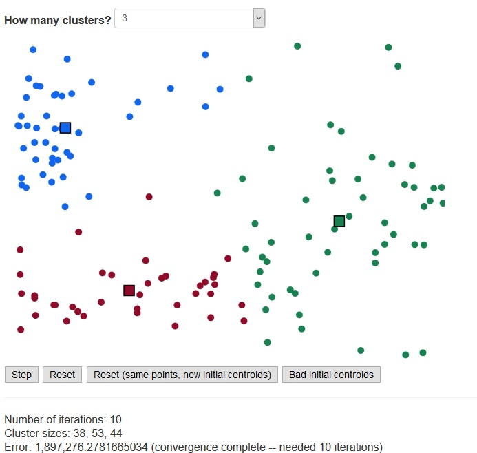

# k-Means Visualization

k-means visualization  
Last Updated: September 21, 2018  
Author: Aaron Blumenfeld

## ABOUT:

Points are generated (semi-)randomly: 135 points are generated. A 30-point cluster in the top left is generated,
followed by a 20-point cluster in the middle right, followed by a 35-point cluster in the bottom. 50 points
are then randomly generated uniformly across the entire canvas. Initial centroids are generated randomly.
No special algorithms (like k-means++) are used here. You can also keep the same points and generate new
random initial centroids.

Can choose k = 3, 4, or 5. Can also force a bad initial centroid assignment leading to an empty cluster.

Some stats are also shown, demonstrating the speed of convergence and the fact that k-means
only converges to a local minimum, not necessarily an absolute minimum (try choosing with different
initial clusters and looking at the error term, and the cluster sizes). An iteration is defined to
be a cluster assignment and a re-computation of the centroids.

Can be seen live at http://aaronblumenfeld.com/kmeans/